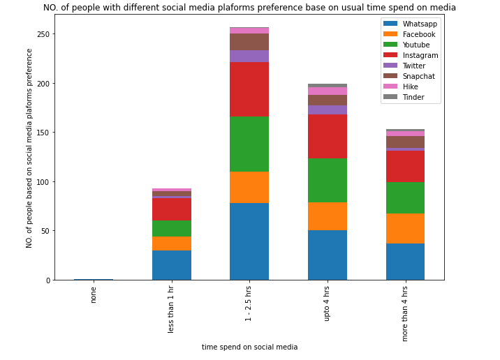

# 07_Social_Media_Project_1

In this assignment, we are using Pandas to analyze data related to social media and build a series of meaningful charts.

  

## **1. Authors**

This project was created and authored by:
* **Anna Wrobel**
* **Latyr Thiao**
* **Leah Lindy**
* **Lujane Abdelgadir**
* **Prajakta Kalvankar**
* **Stephen Zhang**

## **2. Requirements / Specifications**

The [business & technical requirements](001-Instructions/README.md) that must be met by the solution.

## **3. Prerequisites**

The mandatory steps to be taken to make the code work smoothly.

### **3.1 License & Key**

The following key will be required:
* not applicable

### **3.2 Installing**

The assumption here is that your computer is running on Windows 10.
Feel free to adjust if you are using a Mac OS or any other operating system.

What software do you need and how to install them?

* Anaconda
* Jupyter Notebook

## **4. Tools & Coding Languages**

The following tools and coding languages were used:

* Python
* Pandas
* Jupyter Notebook

## **5. Data Source(s)**

* [Data source](002-Code/001-Data/Effects_of_Social_Media_(Responses).csv)
* [Proposal](002-Code/001-Data/Archives/Best_Team_Project_1_Proposal.docx)

## **6. Run the code and see presentation**

### **Step 1: The code is located here**

The code is available as follows:
* [Jupyter Notebook](002-Code/002-Deliverables/Effects_of_Social_Media_Analysis_combined.ipynb)

### **Step 2: Presentation**

The code is available as follows:
* [Presentation](002-Code/002-Deliverables/Social_Media_v0.03.pptx)

## **7. User Acceptance Testing**

Acceptence criteria:  
The [business & technical requirements](001-Instructions/README.md) that must be met by the solution.

## **8. Deployment**

* Not applicable

## **9. Expected result**

The outcome should be similar to the below:

  

 

